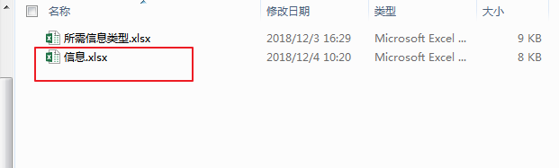

# Http2Excel
网页数据转excel工具

### 网页
[http://118.24.219.236:8080/](http://118.24.219.236:8080/)

### 配置所需表格
1> 选择Excel文件夹下《所需信息类型.xlsx》，里面每一个页签代表一张单子所需的全部类型。

2> 上方的配置表中每个页签（图左）代表一个模版所需的字段， 模版也在Excel文件夹下（图右）

3> 模版文件， 栗子中的《信息.xlsx》即为要导出的模版

**字段使用格式为     &=$Name， Name就是在图一中配置的类型**

### 导表与导出
打开HttpClient.exe 
 * 刷新配置：更改上方的配置表后点击刷新
 * 上传配置：把配置文件上传服务器，然后网页上即可出现相对应的表格及字段
 * 用户列表：点击后拉取服务器上已上传的玩家信息，“双击”玩家的身份信息后会弹出另一个框，点击"转换"选择对应的模版几颗把所有信息导入

#### 参考部署
 * http://supervisord.org/configuration.html
 * https://www.cnblogs.com/xtary/p/9528125.html
 * https://www.cnblogs.com/Leo_wl/p/5734988.html#_label7
 * https://segmentfault.com/a/1190000003955182

